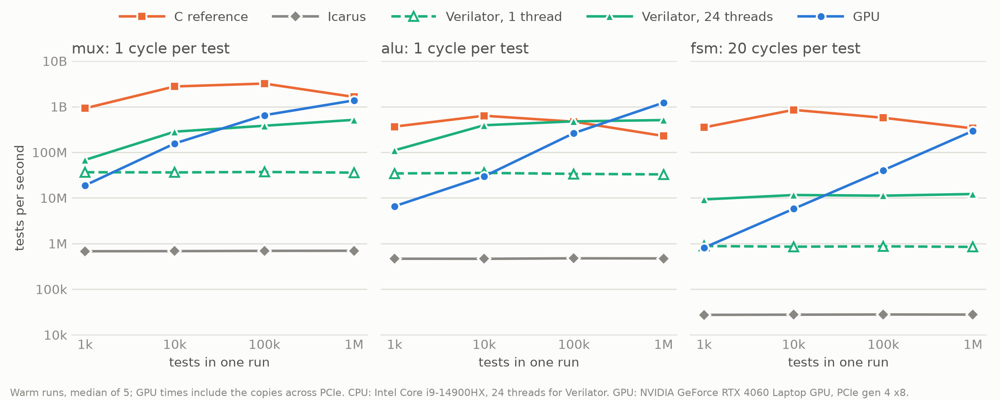

# bitlane

bitlane is a gate-level logic simulator that runs on the GPU. Yosys flattens a Verilog
design into AND, OR, XOR, NOT and MUX gates plus D flip-flops, Python sorts the gates
into levels, and a CUDA kernel evaluates one level per launch for many tests at once.
Each 32-bit word holds the value of one net in 32 different tests, one test per bit, so
a single AND instruction simulates an AND gate 32 times. The simulator is checked
against Icarus Verilog, cycle by cycle, on random tests.

**The result.** On an 8-bit ALU (297 gates) the GPU simulates one million random tests
at 1.2 billion tests per second, counting the upload of the stimulus and the download
of the outputs. That is 2.4 times Verilator on 24 cores and 5.4 times a vectorised
single-core C version of the same algorithm at the same batch size (1.9 times that C
version at its own best batch size). At 100,000 tests per run and below, and on designs
of one or two dozen gates, the CPU wins. The numbers and the reasons are below.



## How it works

1. **Synthesis.** `scripts/synth.ys` has Yosys flatten the design into five gate types
   and one flip-flop type (positive edge, D input). Enables and synchronous resets
   become logic in front of D. The result is a JSON netlist.
2. **Levels.** Inputs, constants and flip-flop outputs are level 0. A gate's level is
   one more than the highest level among its inputs (Kahn's algorithm). Gates in the
   same level do not depend on each other, so they can all be evaluated at once.
   Gates left unsorted are on a combinational loop or fed by one, and are reported as
   an error.
3. **Packing.** The gates are stored as flat arrays sorted by level. Values live in
   `vals[net][word]`: bit `t` of word `w` is the net's value in test `32 * w + t`.
   A gate is then one bitwise operation per word; a MUX is `(b & s) | (a & ~s)`.
4. **The kernel.** One launch per level, one thread per (gate, word). Thread `i` takes
   gate `i / n_words` and word `i % n_words`, so neighbouring threads read and write
   neighbouring words of the same rows and the memory accesses coalesce.
5. **The clock.** Each cycle applies the inputs, evaluates the levels in order, samples
   the outputs, then lets every flip-flop capture its D: read every D first, then
   write every Q.

| File | What it holds |
|---|---|
| `scripts/synth.ys`, `src/bitlane/synth.py` | the Yosys flow |
| `src/bitlane/netlist.py` | the JSON reader: nets, gates, flip-flops, the clock |
| `src/bitlane/levels.py` | level sorting and the packed arrays |
| `src/bitlane/refsim.py` | the NumPy simulator, the readable version of the algorithm |
| `cuda/refsim.c` | the same algorithm in C: the CPU baseline |
| `cuda/kernel.cu` | the CUDA kernel |
| `src/bitlane/native.py` | calls the C and CUDA code (`cuda/bitlane.h`) through ctypes |
| `src/bitlane/stimulus.py` | random stimulus, with the reset port held at 1 in the first cycle |
| `src/bitlane/icarus.py` | the Icarus harness and the cycle-by-cycle compare |
| `src/bitlane/verilator.py` | the Verilator harness |
| `src/bitlane/bench.py`, `scripts/chart.py` | the benchmark and the chart |
| `src/bitlane/__init__.py` | the `bitlane` command: synth, levels, sim, check, bench |

## Correctness

Icarus Verilog is the reference. A generated testbench replays the same random stimulus
through the original Verilog, and every output is compared in every cycle of every test.

bitlane is two-state (0 or 1) and its flip-flops start at 0 in every test. Icarus is
four-state, its flip-flops start at x, and it runs all the tests back to back in one
simulation, so each test starts where the previous one ended. So every test of a
clocked design begins with a reset cycle, and the comparison starts in the cycle after
it. An x or z from Icarus after reset counts as a mismatch.

```bash
uv run bitlane check designs/alu.v --gpu
uv run bitlane check designs/fsm.v --reset rst --gpu
uv run pytest
```

`check` runs 10,000 random tests of 20 cycles each through the NumPy simulator, or
through the CUDA kernel with `--gpu`. The test suite compares the NumPy simulator, the
C version and the CUDA kernel with Icarus on five designs, the kernel with the C
version word for word, and the Verilator harness with the NumPy simulator. It also
covers edge cases in the netlist reader (x and z bits, outputs wired straight to an
input or a constant, two clocks) and in the level sorter (a combinational loop).

The benchmark only times the simulators. It does not compare their outputs.

## Results

Millions of tests per second. Warm runs: set up once, then stimulus in host memory to
outputs in host memory, wall clock, median of 5. CPU: Intel Core i9-14900HX, 24 threads
for Verilator. GPU: NVIDIA GeForce RTX 4060 Laptop GPU, PCIe gen 4 x8.

**mux**: 8-bit 4:1 multiplexer, 24 gates in 2 levels, 1 cycle per test.

| tests | C reference | Icarus | Verilator, 1 thread | Verilator, 24 threads | GPU |
|---:|---:|---:|---:|---:|---:|
| 1,000 | 920 | 0.678 | 36.6 | 68.0 | 18.8 |
| 10,000 | 2,773 | 0.683 | 36.3 | 283 | 156 |
| 100,000 | 3,206 | 0.691 | 37.1 | 382 | 649 |
| 1,000,000 | 1,634 | 0.696 | 35.8 | 515 | 1,373 |

**alu**: 8-bit ALU with eight operations, 297 gates in 17 levels, 1 cycle per test.

| tests | C reference | Icarus | Verilator, 1 thread | Verilator, 24 threads | GPU |
|---:|---:|---:|---:|---:|---:|
| 1,000 | 366 | 0.465 | 34.4 | 110 | 6.58 |
| 10,000 | 633 | 0.464 | 35.3 | 392 | 29.7 |
| 100,000 | 469 | 0.475 | 33.7 | 477 | 263 |
| 1,000,000 | 228 | 0.472 | 32.8 | 508 | 1,223 |

**fsm**: sequence detector, 14 gates in 5 levels and 2 flip-flops, 20 cycles per test.

| tests | C reference | Icarus | Verilator, 1 thread | Verilator, 24 threads | GPU |
|---:|---:|---:|---:|---:|---:|
| 1,000 | 351 | 0.0274 | 0.882 | 9.27 | 0.810 |
| 10,000 | 851 | 0.0277 | 0.855 | 11.6 | 5.77 |
| 100,000 | 571 | 0.0279 | 0.870 | 11.2 | 40.4 |
| 1,000,000 | 335 | 0.0278 | 0.845 | 12.2 | 295 |

Cold runs (open + run + close, so the buffers are allocated and freed inside the timed
call) at 1,000,000 tests, in millions of tests per second:

| design | C reference, cold | its allocation | GPU, cold | its allocation |
|---|---:|---:|---:|---:|
| mux | 302 | 2.70 ms | 283 | 2.81 ms |
| alu | 51.3 | 15.10 ms | 214 | 3.86 ms |
| fsm | 187 | 2.36 ms | 123 | 4.76 ms |

On the ALU the GPU's allocation falls under 10% of the total time after 42.5 million
tests through one open simulator.

## When the GPU wins and when it doesn't

**It wins with many tests and enough gates.** The ALU at one million tests is the one
case here: 1,223 million tests per second against 508 million for Verilator on 24 cores
and 228 million for the C reference.

**The C reference's best is at a smaller batch.** Its speed follows the cache sizes. On
the ALU, 10,000 tests need 0.4 MiB of net values, inside one core's 2 MiB L2 cache, and
run at 633 million tests per second. 100,000 tests need 3.8 MiB and run at 469 million.
One million need 38 MiB, more than the 36 MiB L3 cache, and run at 228 million. Cache
misses were not counted, so the cause is an inference. A fair summary is that the GPU
at its best is 1.9 times one CPU core at its best, and 5.4 times at the same batch
size.

**It loses at 100,000 tests per run and below.** A run of the ALU is 19 kernel launches
and two copies across PCIe however few tests there are. The GPU takes between 0.15 and
0.38 ms for anything from 1,000 to 100,000 ALU tests: the time is fixed cost, not work.
A launch costs about 7 µs: at 1,000 tests the state machine's 181 launches take 1.2 ms.
The crossover with the C reference is between 100,000 and one million tests.

**It loses on tiny designs.** The mux has 24 gates in 2 levels. The C reference stays
ahead at every size and the GPU only draws close at one million tests. There the GPU
takes 0.73 ms on the mux and 0.82 ms on the ALU, which has 12 times the gates, so most
of the mux's time is not gate evaluation. It is probably the copies, 5.25 MB across
PCIe per run. The split was not measured.

**It loses on tiny designs with a clock too.** Twenty cycles of the state machine are
181 launches for 14 gates. The GPU reaches 295 million tests per second at one million
tests and the C reference 335 million.

**A cold call pays for setup.** Opening the simulator, running one million ALU tests
once and closing it gives the GPU 214 million tests per second instead of 1,223
million. The C reference drops too, from 228 million to 51 million, so cold the GPU is
still 4.2 times ahead on the ALU, but behind on the mux and the state machine. Either
one pays off when an open simulator is reused.

**The algorithm matters more than the hardware.** The single-core C reference beats
Verilator on 24 cores on the mux and the state machine at every size, by 3 times and
by 27 times at one million tests. Verilator simulates one test at a time; packing
32 tests into a word, which the compiler then vectorises, is what makes both the C
version and the GPU version fast.

## What each column includes

Every simulator gets the same random stimulus at each size. Every figure is wall-clock
time, the median of five runs. File I/O is never timed for any simulator.

- **C reference.** One call of `bitlane_run` on an open simulator: copy the stimulus
  rows in, evaluate, copy the output rows out. One thread, `gcc -O3 -march=native`.
- **GPU.** One call of `bitlane_run_gpu` on an open simulator: upload the stimulus,
  launch every level of every cycle, download the outputs. The buffers on the GPU are
  allocated beforehand. The download waits for every queued launch, so the timer stops
  only when the results are in host memory.
- **Packing.** The C reference and the GPU are given the stimulus already packed 32
  tests to a word and leave the outputs packed. The packing is done once in NumPy,
  untimed, and the benchmark does not unpack the outputs. Icarus and Verilator read one
  row per test and cycle inside their timed loops.
- **Icarus.** The testbench loads the stimulus file before the first cycle and writes
  the outputs after the last. It prints a marker at each of those two points and the
  time between the markers is the figure.
- **Verilator.** The model and the loop around it are compiled with
  `-O3 -march=native`. The stimulus is in memory and the timer is around the simulation
  loop alone. With 24 threads, each thread has its own model instance and simulates
  its share of the tests; the threads are started, and each model has run once, before
  the timer starts. Verilator's own `--threads` option parallelises within one model,
  which suits large designs and is not the fair baseline for running independent tests
  in parallel, so it is not in the table.
- **Before timing.** The C reference and the GPU run the same workload untimed for 1.5
  seconds first. Before that the GPU is brought to its full clock with one second of
  memory fills. This laptop's GPU drops to a low clock after a few idle seconds, and a
  light workload (few tests, or a small design) leaves it at about a fifth of its full
  clock, up to ten times slower, for as long as it runs. The wake-up is there so that
  every GPU figure is taken at the full clock; the clock itself is not recorded.
- **Cold.** Open, one run and close, timed together: allocating the buffers, uploading
  the netlist and freeing everything, per call. The process has already created its
  CUDA context and loaded the kernels, so GPU start-up is not included.

24 is the number of physical cores (8 performance, 16 efficiency). The 24-thread
Verilator figure is the noisiest in the tables: forty runs of the ALU at one million
tests ranged from 175 to 523 million tests per second, with a median of 437. The
slowest of the 24 threads decides the time.

## What transfers to ML kernels

The kernel is small, but several of the questions it raised come up in ML kernels too.

- **Layout decides whether accesses coalesce.** `vals[net][word]` with one thread per
  word puts neighbouring threads on neighbouring addresses. It is the same choice as
  which dimension of a tensor is contiguous.
- **A level is an elementwise kernel, not a matrix multiply.** Each thread reads three
  words and writes one for a single bitwise operation: the low arithmetic intensity of
  an activation function, not of a dense layer. Frameworks fuse such kernels into their
  neighbours, and fusing levels would be the same move.
- **Launch overhead sets the smallest useful batch.** The ALU's 19 launches cost the
  same whatever the batch size. Small-batch inference has the same problem and the
  same fixes: fusing kernels, and replaying the launch sequence with CUDA Graphs.
- **Transfers and allocation are part of the cost.** The headline number includes the
  upload and the download, and the cold number shows what allocating per call costs.
  Frameworks keep memory pools for the same reason.
- **Launches are asynchronous, so a timer needs a synchronisation point.** Timing the
  launch loop alone would measure how fast work is queued.
- **A benchmark has to pin down the GPU's power state.** The same kernel ran up to ten
  times slower when the GPU had idled for a few seconds beforehand.
- **A fast kernel is checked against a slow, trusted one.** Icarus here; a CPU
  reference implementation for a custom operator.

## Limits

- One clock, positive edge only, no memories, no latches. An asynchronous reset is
  rejected by the Yosys flow.
- The reset must be synchronous and active-high: `--reset` holds the named port at 1
  in the first cycle, and that cycle must leave every flip-flop at a known value.
- Two-state only: an x in the netlist becomes 0 with a warning, a z is an error.
- Ports are at most 64 bits wide.
- A design whose only input is the clock is not supported.
- The stimulus is uniform random. After the first cycle the reset port is random like
  every other input, so tests of a clocked design seldom get far from reset.
- The designs are tiny, 14 to 297 gates. Nothing here says how a large design behaves.
- The C reference is single-threaded. The GPU at its best is only 1.9 times one core
  at its best batch size, so a multi-threaded C reference would very likely overtake
  the GPU on the ALU. It was not measured.
- The largest run is one million tests. The GPU's curve is still rising there on all
  three designs: from 100,000 to one million tests it gains 2.1 times on the mux, 4.7
  times on the ALU and 7.3 times on the state machine.
- The GPU's time was not split between the copies and the kernels, and the kernel has
  not been profiled. The copies use pageable host memory and do not overlap the
  kernels.
- One machine, one laptop GPU. The numbers move with temperature and background load.
- One kernel launch per level, nothing fused.

## Future work

- Fewer launches: fuse small levels, or replay the launch sequence with CUDA Graphs.
- Pinned host memory, and copies that overlap the kernels.
- 64-bit words.
- A multi-threaded C reference.
- A real design: PicoRV32, which needs memories.

## Build and run

Needs an NVIDIA GPU with the CUDA toolkit, CMake 3.24 or newer, gcc, g++ and make
(`build-essential` on Ubuntu), Yosys, Icarus Verilog, Verilator and
[uv](https://docs.astral.sh/uv/). Developed on Ubuntu 24.04 under WSL2 with CUDA 13.3,
Yosys 0.33, Icarus Verilog 12.0 and Verilator 5.020. The shared library is built by
CMake the first time it is needed. `cuda/CMakeLists.txt` targets the RTX 4060's
architecture (`sm_89`); change `CUDA_ARCHITECTURES` for another GPU.

```bash
uv run pytest                              # ours against Icarus, Verilator against ours
uv run bitlane synth designs/alu.v         # Verilog to gates: build/alu.json
uv run bitlane levels build/alu.json       # gates per level
uv run bitlane check designs/alu.v --gpu   # 10,000 random tests against Icarus
```

The three benchmark runs behind the tables, and the chart. `--threads` is the number
of physical cores; each run writes `results/bench_<design>.json`.

```bash
uv run bitlane bench designs/mux.v --threads 24
uv run bitlane bench designs/alu.v --threads 24
uv run bitlane bench designs/fsm.v --reset rst --cycles 20 --threads 24
uv run scripts/chart.py
```

## License

MIT.
